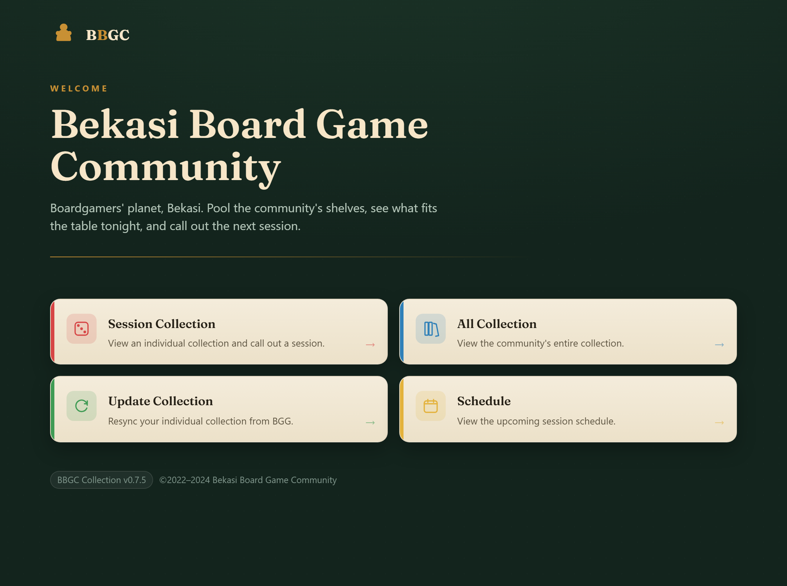
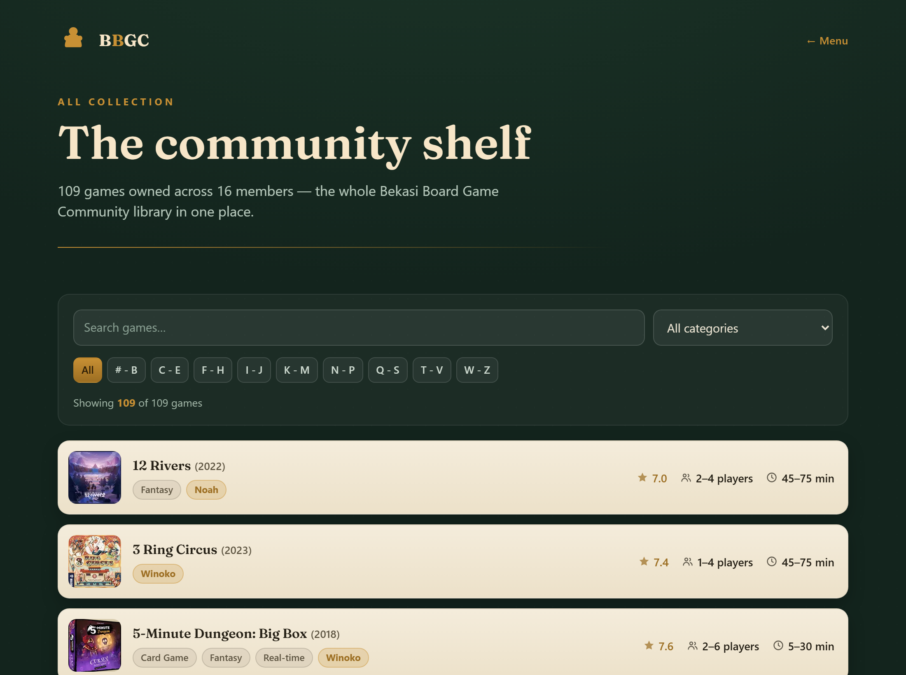
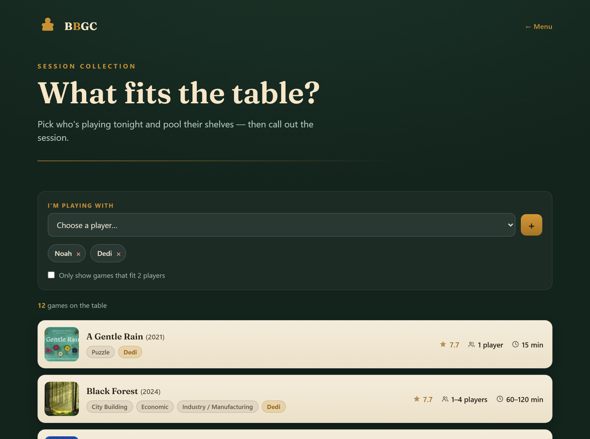

# 🎲 BBGC — Barudak Board Game Club Collection Hub

**Pool the community's shelves, see what fits the table tonight, and call out the next session.**

A felt-table-themed web app that brings a board game community's collections together in one place — browse the whole library, pick who's playing and instantly see which games you can play, and pull any collection straight from BoardGameGeek.

[**Live demo →**](https://board-game-collection-viewer.vercel.app)



---

## ✨ What it does

| Page | What you get |
| ---- | ------------ |
| **Home** | A tile menu into every section, styled like a green felt game table. |
| **Collection** (`/collection`) | One page, three tabs: **Browse all** (the whole **109-game / 16-member** library with search, A–Z index, and category/member filters), **Plan a session** (the *"I'm playing with…"* pooled-collection mechanic → call a session), and **Add from BGG** (pull a BoardGameGeek username's owned games). |
| **Schedule** (`/schedule`) | Upcoming sessions with **RSVP** (in / maybe / out), a pending tracker, host edit/cancel, add-to-calendar, and a past-sessions log. |
| **Community Stats** (`/community`) | Biggest collectors, most-owned games, and one-of-a-kind titles. |
| **Collection view** (`/[username]`) | A clean, sortable view of any BGG collection with summary stats. |





---

## 🎮 How to use it (for club members)

No accounts, no passwords — just open the site and go. *(This guide is also built into the site at **`/help`**.)*

- **Browse the whole shelf** → **Collection → Browse all**. Search by name, jump with the A–Z index, or use the dropdowns to filter by **category** or by **member** ("show me everything Noah owns").
- **Find a game for tonight** → **Collection → Plan a session**. Add who's at the table under *"I'm playing with…"*, and it pools everyone's games into one list. Narrow it with the *"only games that fit N players"* and *"we've got ~2 hours"* filters.
- **Call a session** → on that same tab, set a time, place, and the game(s) you're playing, then **Call session**.
- **RSVP** → **Schedule** → pick your name under *"You are"*, then hit **I'm in / Maybe / Can't make it** on any session. You can also tap **add to calendar**. The person who called a session can **Edit** or **Cancel** it. Past game nights live under **Show past sessions**.
- **See the club's stats** → **Community Stats**: biggest collectors, most-owned games, and one-of-a-kind titles.

> Tip: your name is remembered on each device, so you only pick it once.

---

## 🧱 Tech stack

- **[Next.js 16](https://nextjs.org)** (App Router) + **React 19** server components
- **TypeScript** (strict)
- **Tailwind CSS v4** + a hand-built felt/parchment/gold design system in [`app/globals.css`](app/globals.css)
- **[Fraunces](https://fonts.google.com/specimen/Fraunces)** display font via `next/font`
- **BoardGameGeek** XML API + the public `api.geekdo.com` JSON API for high-resolution artwork
- **[Supabase](https://supabase.com)** (Postgres) for persistent sessions + RSVPs (optional — falls back to an in-memory store; see [DEPLOYMENT.md](DEPLOYMENT.md))
- **[Playwright](https://playwright.dev)** for the data-scraping scripts
- Deployed free on **[Vercel](https://vercel.com)**

---

## 🚀 Getting started

```bash
npm install
npm run dev
```

Open [http://localhost:3000](http://localhost:3000).

> 💡 On `/update`, try the username **`Deedeen`** to load a real BoardGameGeek collection, or **`demo`** for sample data.

### Production build

```bash
npm run build
npm run start
```

### Lint

```bash
npm run lint
```

---

## 🗂️ Project structure

```text
app/
├── page.tsx                         # Home — tile menu
├── all/page.tsx                     # Community collection (A–Z, search, owners)
├── session/page.tsx                 # "I'm playing with" session builder
├── update/page.tsx                  # Resync a collection from BGG
├── schedule/page.tsx                # Upcoming sessions (coming soon)
├── [username]/                      # View any BGG collection
│   ├── page.tsx · loading.tsx · error.tsx
├── api/collection/[username]/route.ts
└── globals.css                      # Felt/parchment/gold design system

components/
├── PageHeader.tsx                   # Shared logo bar + back link
├── CommunityList.tsx                # Search + A–Z index + category filter
├── GameRow.tsx                      # One parchment game row (crisp image)
├── SessionBuilder.tsx              # Player picker + pooled-collection logic
├── CollectionStats.tsx · SearchForm.tsx · ComingSoon.tsx

lib/
├── community.ts                     # Scraped community data (games + members)
├── deedeen-collection.ts            # A real scraped BGG collection
├── collection.ts                    # BGG fetch + retry + demo fallback
├── bgg.ts · types.ts · utils.ts

scripts/                             # Playwright data-refresh scrapers
├── scrape-community.mjs             # → lib/community.ts
├── scrape-collection.mjs · build-deedeen.mjs
```

---

## 🔄 Refreshing the data

The community library is scraped from the live BBGC site and enriched with high-resolution
artwork (BGG's default thumbnails are only 200×150 and look pixelated — the scraper pulls
the pre-sized **300×320** image instead so every cover stays crisp).

```bash
# Re-scrape the community collection + members → lib/community.ts
node scripts/scrape-community.mjs

# Re-scrape an individual BGG collection → lib/deedeen-collection.ts
node scripts/scrape-collection.mjs <bgg-username>
node scripts/build-deedeen.mjs
```

> ℹ️ **Why scraping?** BoardGameGeek's XML API now requires authentication (returns `401`),
> so collections are gathered via a headless-browser scrape + the public geekdo JSON API and
> baked into the app as static data.

---

## 🗺️ Roadmap

- [x] Felt-table themed community hub with uniform styling
- [x] All Collection — search, A–Z index, category filter, owner badges
- [x] Session builder — "I'm playing with" pooled-collection mechanic
- [x] High-resolution, non-pixelated game artwork
- [x] Call a session + RSVP schedule (Supabase-backed, with an in-memory dev fallback)
- [x] Automated weekly refresh of the community data ([GitHub Action](.github/workflows/refresh-community.yml))
- [x] Community stats — biggest collectors, most-owned & one-of-a-kind games
- [x] Filter the collection by member; play-history of past sessions
- [x] Unit test suite ([Vitest](https://vitest.dev) — `npm test`)
- [ ] Member accounts + self-service collection sync — **deferred** until BoardGameGeek's API is unlocked (no clean third-party identity-verification or sync channel exists today)

---

## 📦 Deployment

Push to `main` and Vercel auto-deploys. To set up from scratch: import the repo at
[vercel.com](https://vercel.com) — it auto-detects Next.js, zero config required.
See [DEPLOYMENT.md](DEPLOYMENT.md) for the full guide, including the deployment-checks gotchas.

---

## 📄 License

MIT — use it for your own community, or as a template for your own collection hub.

## 🙏 Credits

- Board game data & artwork from **[BoardGameGeek](https://boardgamegeek.com)**
- Built for the Barudak Board Game Club
